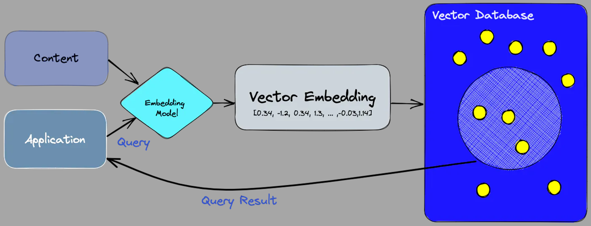

# LLM with LangChain
Here I will explain the code to myself, so when I return to it later, I understand it faster!
___
## <span style="color: darkcyan;">Introduction to LangChain</span>
* LangChain is an OpenSource framework that allows developers working with AI to combine LLMs (like GPT-4) with external sources of computation and data.
* LLMs alone are often limited in their ability to understand the context, interact with the real world, or learn and adapt.
* LLMs have an impressive general knowledge but are limited to their training data.
* LangChain allows you to connect an LLM like GPT-4 to your own sources of data (data-aware)
* Using LangChain you can make your LLM application take actions (agentic-aware)

### LangChain Use Cases: 
* Chat Bots
* Question Answering Systems
* Summarization Tools

### LangChain main concepts: 
* #### LangChain Components:
   * **LLM Wrappers** (allow us to connect to and use LLMs like GPT-4 from the Hugging Face Hub)
   * **Prompt Templates** (allow us to create dynamic prompts which are the input to the LLM)
   * **Indexes** (allow us to extract relevant information for the LLMs)
   * **Memory** (concept of storing and retrieving data in the process of a conversation) 
     * **Short Term Memory** (how to pass data in the context of a single conversation)
     * **Long Term Memory** (how to fetch and update information between conversations)
* #### Chains
  * Allow us to combine multiple components together to solve a specific task and build an entire LLM application
* #### Agents
  * Facilitate interaction between the LLM and external APIs. They play a crucial role in decision-making, determining which actins the LLM should undertake.
  * Agents are enabling tools for LLMs 
  * This process involves taking an action, observing the result, and then repeating the cycle until completion 

___
## <span style="color: orangered;">Requirements</span>
`requirements.txt` contains all the required libraries for the project. You can install all this libraries running this code in the terminal:
```py
pip install -r .\requirements.txt -q
```

To see the version of a library (e.g. langchain) run the following in the terminal:
```py
pip show langchain
```
Note: because of the popularity of langchain, it is updating very fast!

If you want to update a library to its latest version, run this in the terminal:
```py
pip install langchain --upgrade -q
```
 
## <span style="color: darkcyan;">API Keys</span>
#### How to get an `openai API Key`:
1. go to [openai platform website](https://platform.openai.com/) and sign up
2. go to Your profile
3. go to User API Keys
4. here, you can generate a new API key or invalidate an existing one 

#### How to get an `pinecone API Key`:
1. go to [Pincone](https://www.pinecone.io/) and sign up
2. go to API Keys and generate a new one
3. copy the value
4. for the environment go to [pinecone environment](https://docs.pinecone.io/guides/get-started/quickstart) and add the codes in the `.py` file:
    ```Py
    from pinecone import Pinecone, ServerlessSpec
    pc = Pinecone(api_key=os.environ.get('PINECONE_API_KEY'))
    index_name = "docs-quickstart-index"
    
    if index_name not in pc.list_indexes().names():
        pc.create_index(
            name=index_name,
            dimension=2,
            metric="cosine",
            spec=ServerlessSpec(
                cloud='aws',
                region='us-east-1'
            )
        )
    ```
> [!NOTE]
> Due to security reasons create your own API keys when running the program and put them in the `.env` file


## <span style="color: darkcyan;">Pinecone</span>
High performance, scalable, and distributed **vector store** for LLMs.


## <span style="color: darkcyan;">Python-dotenv</span>
`python-dotenv` is a module that allows you to specify environment variables, as key-value pairs, in a `.env` file within your python project directory. 

It is a convenient and secure way to load and use environment variables in your application.

We will save the API keys in the `.env` file.


### How to create a `.env` file:
1. open a text editor in the current directory and add these
2. `OPENAI_API_KEY=""` in which in the `""` will be the openai API key
3. `PINECONE_API_KEY=""` in which in the `""` will be the pinecone API key
4. Click on `Save As`, choose `Save as type: All Files`, `File Name: .env`


### Loading the environment variables:
```Py
import os
from dotenv import load_dotenv, find_dotenv

# loading the variables found in the .env file: 
# first argument of load_dotenv() is the directory of the .env file, or you can simply use the find_dotenv() as argument 
# second argument of load_dotenv() is override=True to override the value of the variable if you change it in .env
load_dotenv(find_dotenv(), override=True)
```

### Getting and Printing API key
```Py
os.environ.get('PINECONE_API_KEY')
print(os.environ.get('PINECONE_API_KEY'))
```
___

## <span style="color: darkcyan;">ChatModels: GPT-4</span>
ChatModels are a variation on classical language models which expose an interface where chat messages or conversations are the inputs and the outputs.

In the terminal run: `pip install -U langchain-openai`
#### Importing a schema for the `messages` schema:
```Py
from langchain.schema import(
    AIMessage,
    HumanMessage,
    SystemMessage
)
from langchain_openai import ChatOpenAI
```

Look at this format of an [API call](https://platform.openai.com/docs/guides/text-generation/chat-completions-api):
1. system: this role helps set the behaviour of the assistant (in langchain: SystemMessage)
2. user: what we ask the assistant (in langchain: HumanMessage)
3. assistant: help store prior responses (in langchain: AIMessage)


#### Creating the `chat` object:
```Py
chat = ChatOpenAI(model_name='gpt-4o-mini', temperature=0.7, max_tokens=1024)
```

#### Creating the `messages` list:
```Py
messages = [
    SystemMessage(content='You are a computer scientist and response only in German.'),
    HumanMessage(content='explain API key in one sentence')
]
output = chat.invoke(messages)
print(output.content)
```
___
## <span style="color: darkcyan;">Prompt Templates</span>
* **Prompt** refers to the input to the model
* **Prompt Templates** are a way to create dynamic prompts for LLMs that are more flexible and easier to use 
* A prompt template takes a piece of text and injects the user's input into that piece of text 

#### Importing the required classes:
```Py
from langchain_core.prompts import PromptTemplate
from langchain.schema import(
    AIMessage,
    HumanMessage,
    SystemMessage
)
from langchain_openai import ChatOpenAI
```

#### Creating the dynamic prompt and `prompt` object:
```Py
template = ''' You are an experienced computer scientist.
Write a few sentences about {concept} in {language}'''

prompt = PromptTemplate(
    input_variables=['concept', 'language'],
    template=template
)
```

#### Initializing `chat` model:
```Py
chat = ChatOpenAI(model_name='gpt-4', temperature=0.7, max_tokens=1024)
```

#### Defining a function to generate output response using dynamic inputs
```Py
def get_response(concept, language):
    formatted_prompt = prompt.format(concept=concept, language=language)
    messages = [
        SystemMessage(content='You are an experienced computer scientist.'),
        HumanMessage(content=formatted_prompt)
    ]
    return chat.invoke(messages)

# Example usage
output = get_response('API key', 'English')
print(output.content)
```
___
## <span style="color: darkcyan;">Simple Chains</span>
* Chains allow us to combine multiple components to create a single and coherent application
#### Importing the required classes:
```Py
from langchain_core.prompts import PromptTemplate
from langchain_openai import ChatOpenAI
from langchain_core.runnables import RunnableSequence
```
#### Initializing `llm` model:
```Py
llm = ChatOpenAI(model_name='gpt-4', temperature=0.5)
```

#### Creating the dynamic prompt and `prompt` object:
```Py
template = ''' You are an experienced computer scientist.
Write a few sentences about {concept} in {language}'''

prompt = PromptTemplate(
    input_variables=['concept', 'language'],
    template=template
)
```

#### Create a runnable sequence with the `prompt` and the `llm` and generate output based on input variables:
```Py
sequence = RunnableSequence(prompt | llm)
output = sequence.invoke({'concept': 'API key', 'language': 'English'})
print(output.content)
```

___
## <span style="color: darkcyan;">Sequential Chains</span>
With **sequential chains**, you can make a series of calls to one or more LLMs. You can take the output from one chain and use it as the input to another chain.


There are two types of sequential chains:
1. SimpleSequentialChain
2. General form of sequential chain

### SimpleSequentialChain 
Represents a series of chains, where each individual chain has a single input and a single output, and the output of one step is used as input to the next.

#### Importing the required classes:
```Py
from langchain_core.prompts import PromptTemplate
from langchain_openai import ChatOpenAI
from langchain.chains import LLMChain, SimpleSequentialChain
```
#### Creating 2 chains:
```Py
# creating the first chain
llm1 = ChatOpenAI(model_name='gpt-4', temperature=0.7)
template = ''' You are an experienced computer scientist.
Write a function that implements the concept of {concept}'''

prompt1 = PromptTemplate(
    input_variables=['concept'],
    template=template
)
chain1 = LLMChain(llm=llm1, prompt=prompt1)

# creating the second chain
llm2 = ChatOpenAI(model_name='gpt-4', temperature=0.7)
template = ''' Given the python function {function}, describe it as detailed as possible'''

prompt2 = PromptTemplate(
    input_variables=['function'],
    template=template
)
chain2 = LLMChain(llm=llm2, prompt=prompt2)
```

#### Combining 2 chains using `SimpleSequentialChain`:
```Py
overall_chain = SimpleSequentialChain(chains=[chain1, chain2], verbose=True)
output = overall_chain.invoke('linear regression')
```
___
## <span style="color: darkcyan;">LangChain Agents</span>
LLMs cannot give accurate answers to complicated calculations! Also, LLMs are out of date and can give old information about newly asked questions. 
Solution: LangChain Agents

#### Importing the required classes:
```Py
from langchain_experimental.agents.agent_toolkits import create_python_agent
from langchain_experimental.tools.python.tool import PythonREPLTool
from langchain_openai import ChatOpenAI
```

#### Creating `llm` model:
```Py
llm = ChatOpenAI(model_name='gpt-4', temperature=0.7)
```

#### Creating `agent_executor`:
```Py
agent_executor = create_python_agent(
    llm=llm,
    tool=PythonREPLTool(),
    verbose=True
)
agent_executor.invoke('Calculate 1.7**5.2')
```
* Creating a Python `agent_executor` using `ChatOpenAI` `llm` allows us to have the language model execute Python code.
* **The `tool` argument:** tools are essentially functions that agents can use to interact with the outside world.
___
## <span style="color: darkcyan;">Embeddings</span>
Text Embeddings are numeric representations of text.
They can be used to measure the relativeness in similarity between two pieces of text (i.e. how close two pieces of text are in meaning.)

The distance between two embeddings or two vectors measures their relatedness which translates to the relatedness between the text concepts they represent.

Similar embeddings or vectors represent similar concepts.

#### Embeddings Applications
* **Text Classification:** assigning a label to a piece of text.
* **Text Clustering:** grouping together pieces of text that are similar in meaning.
* **Question-Answering:** answering a question posed in natural language.
___
## <span style="color: darkcyan;">Vector Databases</span>
### Challenges
* Artificial Intelligence is being used in a variety of industries and has the potential to improve our lives in many ways. 
But it also introduces new challenges.

* One of the biggest challenges is efficient data processing. 
AI applications such as LLMs, Generative AI, and Semantic Search require large amounts of data to train and operate.
Efficient data processing is essential for making AI applications successful. 
Many of the latest AI applications rely on **vector embeddings**. 
Chatbots, question-answering, and machine translation rely on vector embeddings. 

    > **Reminder:** Vector Embeddings mean converting text to numbers that carry semantic information within themselves.
Vector Embeddings are a way of representing text as a set of numbers in a high-dimensional space. 
And the numbers represent meaning of the words in the text.

* Vector Embeddings are critical for the AI to gain understanding and maintain long term memory. 
If you store embeddings in a csv file, or another format that is not dedicated for embeddings, 
the size of the file will increase dramatically and the performance will drop.

    Consequently, we need a specialized database or data store 
specifically designed to manage such large quantities of data in a numeric representation.

### Vector Databases
* Vector Databases are a new type of database, designed to store and query **unstructured data**.

    Unstructured data is data that does not have a fixed schema, such as text, images, and audio.
    (unlike SQL)
#### Some of Vector Databases:
1. Pinecone
2. Chroma
3. milvus
4. qdrant

#### Pinecone
* Vector database designed for storing and querying high dimensional vectors. 
It provides fast and efficient semantic search over vector embeddings.
By integrating OpenAI's LLMs with Pinecone, we combine deep learning capabilities 
for embedding generation with efficient vector storage and retrieval.

### Pipeline for Vector Databases
* Vector databases use a combination of different optimized algorithms that 
    all participate in **Approximate Nearest Neighbor (ANN)** search.
#### Steps:
1. Embedding 
   * Create vector embeddings for the content we want to index. This is done by using an embedding model.
2. Indexing
   * Insert the vector embeddings into the vector database. This is done by associating each vector embedding with a reference to the original content that was used to create it. 
3. Querying
   * Query the vector database for similar content. This is done by using the same embedding model used to create the vector embeddings. The embeddings model is used to create the vector embedding for the query, and this vector embedding is then used to query the database for similar vector embeddings. The similar vector embeddings are then associated with the original content that was used to create them. 
 


___
## <span style="color: darkcyan;">Splitting and Embedding Text Using LangChain</span>
Importing `.env` variables (API Keys):
```Py
import os
from dotenv import load_dotenv, find_dotenv
load_dotenv(find_dotenv(), override=True)
```
There are [langchain document loaders](https://python.langchain.com/v0.1/docs/modules/data_connection/document_loaders/) that are used to load data from almost any type of documents.
In this project, I'll work with PDF document (only because it is a part of my data science course and i want to get familiar with it! :blush:)


First run this in the terminal:
```Py
pip install pypdf
```
Then load the PDF file using:
```Py
from langchain_community.document_loaders import PyPDFLoader
loader = PyPDFLoader("./Sample.pdf")
pages = loader.load_and_split()
```
Examine it with printing the 11th page's content:
```Py
print(pages[10].page_content)
```
Now we combine the pages of the PDF into one string called `whole_pdf`:
```Py
whole_pdf = ''
for page in pages:
    whole_pdf += page.page_content
```

Now we want to split the read document into chunks. We'll use the `RecursiveCharacterTextSplitter` and split the whole pdf into chunks:
```Py
from langchain.text_splitter import RecursiveCharacterTextSplitter
text_splitter = RecursiveCharacterTextSplitter(
    chunk_size=100,         # maximum chunk size
    chunk_overlap=20,       # maximum overlap between chunks size
    length_function=len
)
chunks = text_splitter.create_documents([whole_pdf])
```
Examine it with printing the 101th chunk and number of all the chunks:
```Py
print(chunks[100].page_content)
print(f'Now you have {len(chunks)} chunks')
```
 
## <span style="color: darkcyan;">Inserting the Embeddings into a Pinecone Index</span>
In this part, we'll embed each chunk of text (which we created in the last part using the `chunks = text_splitter.create_documents([whole_pdf])`) into numeric vectors and insert them into a Pinecone index.

[Understanding Indexes](https://docs.pinecone.io/guides/indexes/understanding-indexes): An index is the highest-level organizational unit of vector data in Pinecone. It accepts and stores vectors, serves queries over the vectors it contains, and does other vector operations over its contents.

First, we should import the Pinecone client:
```Py
from pinecone import Pinecone, ServerlessSpec
pc = Pinecone(api_key=os.environ.get('PINECONE_API_KEY'))
```
[Serverless indexes](https://docs.pinecone.io/guides/indexes/understanding-indexes#serverless-indexes): With serverless indexes, you don’t configure or manage any compute or storage resources. Instead, based on a breakthrough architecture, serverless indexes scale automatically based on usage, and you pay only for the amount of data stored and operations performed, with no minimums. This means that there’s no extra cost for having additional indexes.

If you want to **view** all your indexes with their attributes, you can use:
```Py
all_indexes = pc.list_indexes()
```

And if you only want to view the **names** of your indexes, you can use:
```Py
all_indexes = pc.list_indexes().names()
```
If you want to **delete** indexes, you can use the following syntax:
```Py
pc.delete_index("index-name")
```

Creating a new index with the name `sample-index`:
```Py
index_name = "sample-index"

if index_name not in pc.list_indexes().names():
    pc.create_index(
        name=index_name,
        dimension=1536,
        metric="cosine",
        spec=ServerlessSpec(
            cloud='aws',
            region='us-east-1'
        )
    )
```
You can also do and view all the above commands and their results in the [Pinecone](https://www.pinecone.io/) website after you log in. (you just have to reload)

Next, we want to upload the vectors to Pinecone using Langchain:
```Py
from langchain_community.vectorstores import Pinecone
vector_store = Pinecone.from_documents(chunks, embeddings, index_name=index_name)
```
This method has three arguments:
* The `chunks` is a list of text documents that have been obtained in the previous section, using `chunks = text_splitter.create_documents([whole_pdf])`.
    These smaller chunks will be indexed in Python to make it easier to search and retrieve relevant information later on. 
* The `embeddings` object is an instance of the OpenAI embeddings class, created using:
    ```Py
    from langchain_openai import OpenAIEmbeddings
    embeddings = OpenAIEmbeddings()
    ```
  
    It is responsible for converting text data into embeddings using OpenAI's embedding model. 
    These embeddings will be stored in the Pinecone's index and used for similarity search.
* The `index_name` is a string representing the name of the Pinecone index. 

* This method returns a `vector_store` object initialized from documents and embeddings. 

**In a Nutshell**: the method `.from_documents()` processes the input documents, generates the embeddings using the provided OpenAI `embeddings` instance, and returns a new Pinecone `vector_store`. 
The resulting `vector_store` object can perform similarity searches and retrieve relevant documents based on user queries. 

## <span style="color: darkcyan;">Asking Questions (Similarity Search)</span>
So far, we have split the text of a PDF into chunks and embedded them into vectors which are then inserted into a Pinecone index.

### How to ask questions?
1. The user defines a query (e.g. a question)
2. The query is embedded into a vector
3. A similarity search is performed in the vector database
4. The text behind the most similar vectors is the answer to user's question.

```Py
# defining a query
query = 'What is isolation?'

# extracting all the relevant chunks to the query
result = vector_store.similarity_search(query)
print(result)

# iterate over the chunks and only printing the chunk texts
for r in result: 
    print(r.page_content)
    print('-'*50)
```
These chunks represent the answer, but cannot be given to users in chunks. They must be converted into natural language. 

That is where the LLM comes in. We retrieve the most relevant chunks of text and feed them to the language model for the final answer.

First we need to define our LLm model
```Py
from langchain.chains import RetrievalQA
from langchain_openai import ChatOpenAI

llm = ChatOpenAI(model='gpt-4o', temperature=0.6)
```

Then, we have to expose index in a retriever interface.

The retriever interface is a generic interface which makes it easy to combine documents with language models. 
```Py
retriever = vector_store.as_retriever(
    search_type='similarity',
    search_kwargs={'k': 3})
```
`'k': 3` means that it will return the 3 most similar chunks to the user's query.

Finally, we create a chain to answer questions
```Py
chain = RetrievalQA.from_chain_type(
    llm=llm,
    chain_type="stuff",
    retriever=retriever)
```
The default `chain_type="stuff"` uses all of the text from the document in the prompt. 


Now we can ask questions about the content of the document and it will be answered in the natural language:
```Py
answer = chain.invoke(query)
print('Query:', answer['query'], 
      '\nResult:', answer['result'])
```

This is the end of the short introduction to the backbone of OPL application (OpenAI, Pinecone, Langchain).

Next, we will combine all that we have learned to develop an LLm powered application than can answer questions about the content of private documents. 


